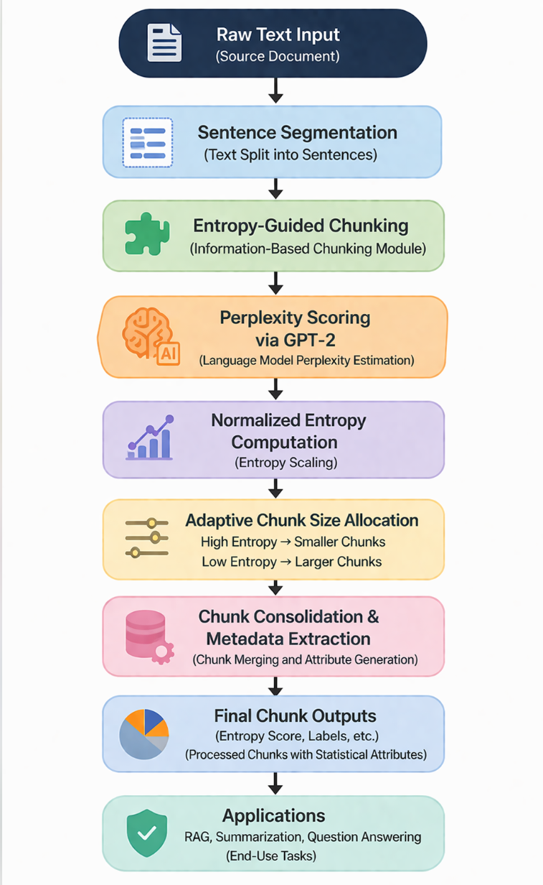

# Entropy-Based Adaptive Chunking for Efficient Retrieval-Augmented Generation (RAG)

##  Overview
This project introduces an entropy-based chunking strategy to improve text segmentation in Retrieval-Augmented Generation (RAG) systems. Unlike traditional fixed-size chunking, the proposed method dynamically segments text based on information density, enabling better context preservation and improved retrieval quality.

##  Problem Statement
Conventional chunking methods in RAG pipelines rely on fixed-size or heuristic-based segmentation. These approaches often disrupt semantic boundaries or combine unrelated information, leading to inefficient retrieval and increased hallucination in downstream language models.

##  Proposed Approach
The proposed method uses entropy as a measure of information density to guide text segmentation. High-entropy regions are split into smaller, more precise chunks, while low-entropy regions are grouped into larger chunks. This adaptive strategy preserves meaningful context boundaries and enhances the effectiveness of retrieval and generation.

##  Key Contributions
- Novel entropy-based adaptive chunking strategy for RAG systems  
- Improved semantic coherence compared to fixed-size chunking  
- Reduction in hallucination through better retrieval relevance  
- Scalable and model-agnostic preprocessing framework  

##  System Architecture

##  Results
Results will be made available after official publication.

##  Abstract
This work proposes an entropy-driven adaptive chunking mechanism for improving the efficiency of Retrieval-Augmented Generation systems. By leveraging information-theoretic measures, the method dynamically segments text into contextually meaningful units, addressing the limitations of traditional fixed-size chunking. Experimental evaluation demonstrates improved retrieval relevance and reduced hallucination, highlighting the effectiveness of the approach in enhancing large language model performance.

##  Status
This work has been accepted at a research conference. Full implementation details, code, and experimental results will be released upon official publication.

}
